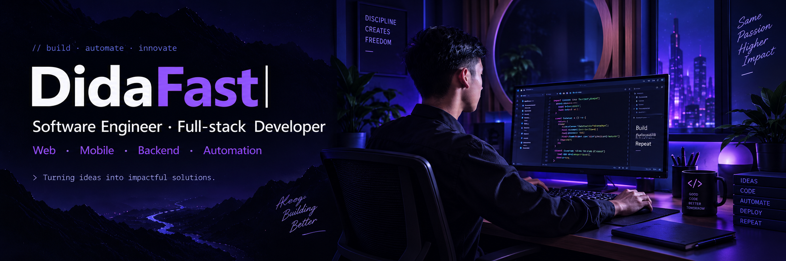

  

 

 

## 👨‍💻 About Me

I'm **Dida**, a Software Engineer focused on building modern web, mobile, backend, and automation systems.

- 🚀 Building real-world applications and automation systems
- 💻 Working with JavaScript, React, Node.js, Flutter, Go & PostgreSQL
- ⚙️ Interested in Backend, DevOps, APIs & scalable systems
- 📚 Informatics student — always learning and building
